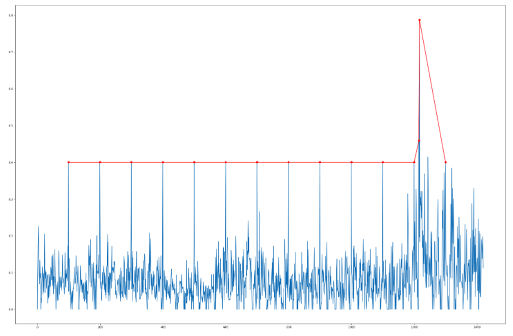
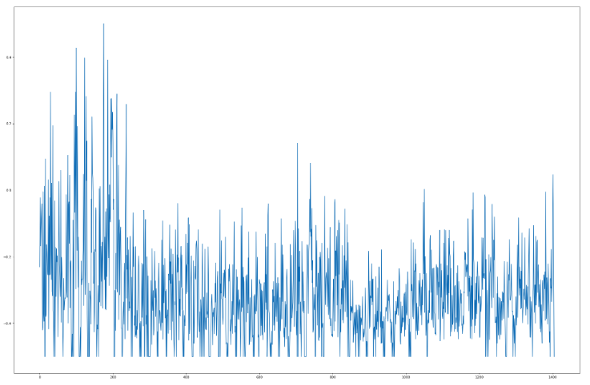
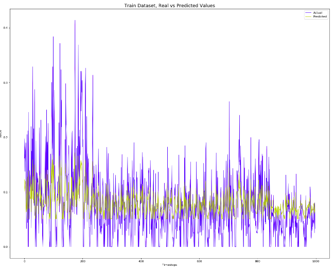
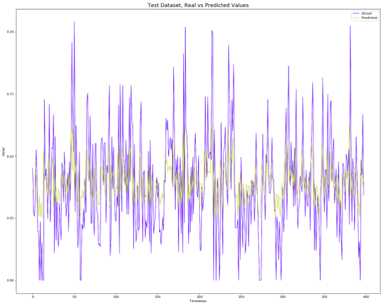

# Anomaly Detection in Time Series Datasets
*authors: Dawid Sitnik, Władysław Sinkiewicz*

**File Description**

* LSTM_approach.ipynb - Jupiter notebook in which LSTM solution is made
* LSTM_approach.r - the same solution made in R with the extraction of the fragment responsible for learning LSTM network.
* yahoo_notebook.Rmd - R notebook that contains statistical, One-class SVM, ESD, and Isolation Forest methods for time series anomaly detection.
* yahoo_notebook.html - knitted R notebook with evaluated results.

## The Aim of The Project
The main goal is to detect anomalies in the time series dataset. As the dataset, we decided to choose data shared by Yahoo called *'A Benchmark Dataset for Time Series Anomaly Detection'*, which is the real traffic data from Yahoo servers. 

The data can be accessed from this URL:
[Yahoo dataset](https://yahooresearch.tumblr.com/post/114590420346/a-benchmark-dataset-for-time-series-anomaly?fbclid=IwAR31SaUo48kFzUCeYPFDfVGRKyqYPW3vmY0XDuci7uIYM-XrrW86QXGerrY)

## Our Approach
In our project, we would like to compare classical unsupervised approaches to modeling with a more modern one. The first group of solutions will be based on analyzing a data distribution and its distance from the mean value. In the second approach, we will try to learn the LSTM network which will be predicting the next values of a time series. If predicted values will differ from the real one, those points will be treated as the out layers. 

## Dataset
This dataset is provided as part of the Yahoo Webscope program, to be used for approved non-commercial research purposes by recipients who have signed a Data Sharing Agreement with Yahoo! Dataset contains real and synthetic time-series with labeled anomalies. Timestamps are replaced by integers with an increment of 1, where each data-point represents 1 hour worth of data. The dataset contains 15 anomalies which are marked by humans and therefore may not be consistent. We decided to choose this dataset because there was a high probability that we would face those kind of task in real live.

Time-series used to evaluate model performance is based on real production traffic of some of the Yahoo! properties. These time series have different scales and length, thus we will be testing models on one of the times series in the dataset. This simplifies anomaly detection task that are produced only by one of the Yahoo! properties. Finding anomalies in other series requires specialized parameter tuning as parameters aren't universal and can't produce models that find anomalies from different sources (there ain't no such thing as a free lunch).

**The dataset fields are:**
* *timestamp*
* *value*
* *is_anomaly*
    
The is_anomaly field is a boolean indicating if the current value at a given timestamp is considered an anomaly.

**Dataset snippet:**

```
  timestamp value is_anomaly
1         1  5.86          0
2         2  5.95          0
3         3  5.92          0
4         4  5.47          0
5         5  5.77          0
6         6  5.73          0
```

The dataset before preprocessing:

<p align="center">
  
</p>

Common exploratory data analysis tools in time-series and non-time series data are histograms. We will also look at the differenced data because we want to use our timestamp (time) axis.

The histogram of untransformed data


The histogram of untransformed data (top) shows normal distributions. This is to be expected given that the underlying sample (1st in our case) has no trend. If the series had a trend, we would difference the data to remove it, and this would transform the data into a more normal shaped distribution (bottom).

Next, we would like to know if time-series is *stationary*. We do this because many traditional statistical time series models rely on time series with such characteristics. In general, time series is *stationary* when it has fairly stable statistical properties over time, particularly mean and variance. The Augmented Dickey-Fuller (ADF) test is the most commonly used metric to access a time series for stationary problems. That test focuses on whether the mean of a series is changing, a variance isn’t tested here. 

ADF test result of one of the Yahoo time series.

```
    Augmented Dickey-Fuller Test

data:  series$value
Dickey-Fuller = -10.364, Lag order = 11, p-value = 0.01
alternative hypothesis: stationary
```

Depending on the result of the test, the null hypothesis can be rejected for a specific significance level - *p*-value. Conventionally, if *p*-value is less 0.05, the time series is likely stationery, whereas a *p* > 0.05 provides no such evidence.

We doesn't always need to split dataset into train/test as some of methods are based on unsupervised learning. Testing  performance of such methods simply can be done by evaluting how many outliers it was able to detect, thus calculating such metrics as precision, recall, confusion matrix and if anomalies can be scored we would add precision/recall or ROC curve.

## Statistical approach

We can find anomalies in time series simply by searching for extreme values or outliers. In the `Dataset` chapter we build histograms of time series values. Most of the time series had distributions close to normal. This means that we can use interquartile distance to determine the outliers. Primary reasons for this choice is were the simplicity of the method. This simplicity associated with IQR means that results can be interpreted easily which would make communication of results to non-technical audience less troublesome. 

This approach has only one parameter which is the IQR coefficient. IQR coefficient determines how far away from the first and third quartile we consider time series value as an outlier. A commonly used rule is that a data point is an outlier if it is 1.5 * IQR above the third quartile or below the first quartile. Illustration of the described outliers detection method:


Outliers found by the statistical approach:


Confusion matrix:


F1 score of the model - 98.37%. Precision and recall metrics are 100% and 96.79% respectively. This means that our model can identify all the outliers present in the dataset, but it is correct in 96.69% of the time.

We also compute the F1 score to evaluate model performance. This score is often more convenient as it combines precision and recalls into a single metric, thus it is a simpler way to compare models. F1 score is a harmonic mean of the precision and recall, harmonic mean gives much more weight to low values, therefore we will get a high F1 score only if precision and recall are high.

It is a topic of discussion whether this metric will be useful in production in our case as it favors classifiers with similar precision and recall. In our task, we work with anomaly detection on an anonymized dataset and we don't know what kind of anomalies we look at. There could be cases that we want to identify all anomalies(high precisions) sacrificing recall. For example, anomalies could mean vital health parameter of a patient and undetected ananomalies will result in the certain death.

Another way to test performance of outliers detection methods is to plot precision-recall or ROC curve. As a rule of thumb it is prefered to use PR curve whenever the positive class is rare (outliers in our case). Plotting PR curve makes sense when we can assign a score/probability to values in dataset. In our IQR approach there is no clear notion of a score of time series values. We tried plotting PR curve choosing as a threashold IQR coefficient, this doesn't gives us scores but we still can see how different values of coefficient affect IQR anomaly detection rate. Code can be found in ``yahoh_notebook`` knitted file in the ``Statistical approach`` section.


## One-class Support Vector Machine

One-class SVM is an extension of the original SVM algorithms that learns a decision boundary that tries to achieve the maximum separation between the sample of the known class and the origin. The algorithm allows only a small part of the dataset to lie on the other side of the decision boundary. These points are considered as outliers.

Kernelized SVM algorithm tries to separate two-class by first mapping instances to a high dimensional space, then it separates those instances using linear SVM within this high-dimension space. In the case of one-class SVM, we have only one class of instances, this means that we try to separate instances in high-dimensional space from the origin. Looking at this from the original space perspective this will correspond to finding the smallest region that encompasses all of the instances. Instances that don't fall within this region are considered as an anomaly.

One-class SVM can only be applied to a set of vectors which means that we need to figure out how to convert time series so that it can be fed to OCSVM. We do this by unfolding the time series into a phase space using time-delay embeddings. Time series embedding vector process:

*x_E(t) = [x(t-E+1) x(x-E+2) ... x(t)]*, where *x_E(t)* is an embedding vector at time *t* and *E* is *embedding dimension*.

Therefore, a time series can be converted to a set of vectors *T_E(N)={x_E(t), t = E ... N}*.

Initially we set hyperparameters based on our knowledge of the OCSVM algorithm and time seires domain datasate. We do this to explain how different paramters affect algorithm anomaly detection perfromance.

After converting a time-series into a set of vectors we run the OCSVM algorithm on them. If the algorithm suggests that embedding vector $x_E(t)$ is an outlier all points from this embedding at set 1(this marks time-series values as an outlier in times series data frame).

We then would set *embedding dimensions* to 5 as it gives an optimistic trade-off between detection rate and false positive. Larger embeddding dimensions will marker a larger are of timestamps as anomalies thus increasing number of false alarms. In our algorithm we stick with implementation were we set all timestamps in the embedding as an anomaly. Possible improvement of OCSM novelty detection can be done by indicating time stampt as a novelty only when large range of embedding dimensions would detect a novelty at a given timestmamp. This would make algorithm less depndent on a particular representation.

The last hyperparameter that we consider is *nu*. It is a regularization parameter of the SVM algorithm and it can be interpreted as an upper bound on the fraction of margin errors and a lower bound of the fraction of support vectors relative to the number of training examples. We set this parameter to 1% as we expect a fairly small number of outliers in the time-series.

As a kernel to one-class SVM, we set RBF function as it makes a good default kernel to non-linear problems. Some papers suggest that RBF kernel performs very well on different types of times series and learning tasks, it still a good practice to pay a closer look at the times series with specialized applications as other kernel functions could have a better performance.

We test different combination of hyperparamters using grid search:
```
window   nu     kernel    scores
    10 0.01    sigmoid 0.9953950
     7 0.01    sigmoid 0.9950425
     5 0.01    sigmoid 0.9946865
     5 0.01     radial 0.9932552
     7 0.01     radial 0.9928977
``` 

As we can see our initall guess of the hyperparamters wasn't far of the best possible combination. We will stick to the paramters we set initially as it suggested by some papers that they have better performance on wider variety of time series.

Outliers detected by One-class SVM:


Confusion matrix:


F1 score of the model - 99.11%. Precision of the OCSVM is 99.14%, recall - 99.07%. Compared to the shallow statistical approach OCSVM algorithm is correct in more cases. These results are easy to explain as OCSVM is a much more complex and robust algorithm which combined with embedding space can be applied to time-series.

Same as in *IQR* anomaly detection method we can't calculate any score for anomalies detected by OCSVM. Thus we can't draw PR curve as an addition model performance indicator. Possible way to tackle this problem is to associate in some way a score to the outlier decision.

## Seasonal Hybrid ESD Model

Season Hybrid ESD (Extreme Studentized Deviant) is a well-known method for identifying anomalies in times series which remains useful and well-performing. Season Hybrid ESD is built on a statistical test, the *Grubbs test*, which defines a statistic for testing the hypothesis that there is a single outlier in a dataset. The ESD applies this test repeatedly, first to the most extreme outlier and then to the smaller outliers. ESD also accounts for seasonality in behavior via time series decomposition.

Visualization of anomalies found by the ESD model:


Confusion matrix:


F1 score - 99.53%. Precision of the ESD model - 100%, recall - 99.07%.

## Isolation forests

Isolation Forest is a novelty detection algorithm which creates random trees until each value is in separate leaf. This random partitioning crates much shorter paths for novelties because instances with distinguishable are mote likely to be separated in the early stages of the partitioning. Therefore, when random forests produce shorter paths for some values, then this value can be considered as an anomaly. In the original isolation forests paper this path length was averaged over a forest of such random trees, this way it possible to measure a anomality of the time stamp value which will act as a decision function.

A visualization that demonstrates the idea that anomalies are separated in the early stages of the Isolation Forest under random partitioning:


Outliers detected by the Isolation forest algorithm:


Confusion matrix:


F1 score - 99.43%. The precision of the Isolation Forests approach is 99.08%, recall - 99.78%.

Precicion/reacall curve, based on the scores assigned by Isolation forest:


## LSTM Neural Network Approach

A powerful type of neural network designed to handle sequence dependence is called recurrent neural networks. The Long Short-Term Memory network or LSTM network is a type of recurrent neural network used in deep learning because very large architectures can be successfully trained.

Before feeding the network with the data we needed to extend our dataset by assigning new attributes to each value. The new attributes are previous values of time series, so for value recorded at time t, we extended it of values from t-1, t-2 ... t-n. In this case, we got a data frame of size (initial length of data frame x n). We couldn't create all of the attributes for last n observations from each sub dataset so we decided to not include them in our training dataset. 

#### Data Preprocessing
Before feeding the network with data we should preprocess our data. The first thing which comes to the mind is to detect trends and seasonality and delete it from the signal. However, in this case, there was no seasonality nor trend. Then we checked if the data doesn't contain any null values and outliers, but fortunately, it didn't.

Another thing which can be done is data normalization. In our purpose we decided to normalize our data due to this formule:
```
df = (df - df.mean()) / (df.max() - df.min())
```

As we can see, our signal is quite complex - it changes its values drastically, so we also have tried to smooth it a little bit using a rolling window technique trying different values of the window. The window size which gave us the best result was 5.

The preprocessed signal can be seen in the picture below:

<p align="center">
  
</p>


So finally a description of our data is:


Because of the LSTM neural network nature, we had to reshape our data one more time to get its final dimension equal to (initial length of data frame x n x 1). It had to be done because those types of networks operate only on 3D vectors. The fraction of the training dataset can be seen in the picture.


The final architecture of the LSTM NN looks like:


Its graphical illustration can be seen below:


#### Solution
We repeated the learning process many times, trying different sizes of:
* n - attributes which were value from the previous timestep
* window size for smoothing the signal
* epochs 

The best-obtained result was for:
* lookback n = 5
* smoothing window size = 5
* 20 epochs

The learning process of the network can be seen here:


Signal prediction on training dataset:

<p align="center">
  
</p>


Signal prediction on testing dataset:

<p align="center">
  
</p>


The model isn't overtrained, as it can be seen at the pictures, signal predicted basing on the test dataset is as good as the one predicted on the training dataset.

Then, to point the anomalies we tried to find the threshold which is the absolute value of the difference between real and predicted values. To do that we split our results into two groups - anomaly data and normal data. The summarize of absolute errors for each group can be seen at the picture:

group without anomalies


group with anomalies


The max error for the group without anomalies equals to 0.151 when min error for a group with anomalies is 0.1639. It means, that we can easily split the difference between those two groups if we choose a tolerated error threshold sensibly.

The threshold value set to differentiate groups correctly is *5.4 * (standard deviation of the whole dataset)*.
With this value it was possible to mark all anomalies correctely, while getting only one false positive.

## Summary
It was hard to decide where to put the line between normal data and anomalies. In the first approaches, we decided to treat the dataset conservatively, assigning more data points to the group of anomalies. We could fix the parameters to separate the dataset perfectly, but we decided to do so only in the last part of the task. To prepare for a different set of data we would subordinate the parameters from the F1 score, choosing that one which gives the best result on testing data. The aim of this exercise however was only to prepare for one dataset, which we did properly. 

The basic metric for model assessment was F1 because it is robust for imbalanced datasets. We also calculated precision and recall for comparison.

As a baseline, we used interquartile distance with a coefficient 1.5. This gives us a solid yet simple method for novelty detection. We got 98.31% of F1 score, 96.69% of a recall, and 100% of precision, finding all of the anomalies and getting 47 of false-positive values. Depending on the task, this result would be treated as a success or not. It gave us a good starting point and a safe solution for the case in which getting a false negative would cause the biggest consequences.

One-class Support Vector Machine improved recall of anomaly detection by 1%. This is a rather high improvement as our statistical approach was already acceptable. SVM is a more sophisticated algorithm and it is extensively used in classification and regression tasks because of its high accuracy and clear interpretation.

Another machine learning algorithm that we used to identify time-series anomalies was Isolation Forest. It provides the best overall performance among methods that aren't based on deep learning giving 99.43% of F1 score, 99.08% of precision, and 99.78% of recall. The algorithm is easily interpretable, doesn't require much of preprocessing steps, and is designed specifically for detecting anomalies. Isolation Forest doesn't have major drawbacks which makes it one of the most preferable choices in our task.

In the end, we tried a more complex solution which was deep learning. This process required the biggest amount of data preprocessing and took a lot of time because training bidirectional networks is a challenging task for the machine. 
In this example, the data was transformed in a way that didn't need the rows to be labeled, so it was also an unsupervised method. Our network was able to mimic the behavior of the data in a very accurate way which allowed us to find all anomalies correctly without getting any false positives. We proved that those types of approaches to the problem can also result in success, getting the best possible score for this model.


